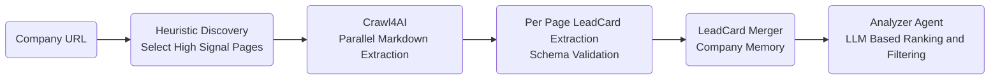

# AI-SDR-Agent

AI-SDR-Agent is an agentic pipeline that crawls company websites, extracts structured company intelligence, builds persistent multi-page company memory, and reasons across multiple companies to rank leads against custom sales goals.
Instead of stopping at raw extraction, the system synthesizes reusable company identity objects and compares them using an LLM-driven reasoning layer—closer to how a real SDR evaluates prospects.

### Project Overview
Traditional web scraping produces fragmented, page-level data that is difficult to compare across companies.
AI-SDR-Agent transforms website content into structured, persistent company memory and uses an analyzer agent to rank and filter leads based on arbitrary sales criteria.

The project is built incrementally to explore how LLMs move from extraction → synthesis → reasoning in real SDR workflows.

### Key Features
1. **Noise-reduced crawling** using Crawl4AI to extract clean, LLM-friendly markdown
2. **Heuristic discovery** of high-signal sub-pages (e.g., product, pricing, integrations, security) instead of naive deep crawls
3. **Schema-strict extraction** using Pydantic for reliable, typed outputs
4. **LeadCard memory** objects that capture reusable, goal-agnostic company identity
5. **Persistent local storage** so the agent does not forget previously analyzed companies
6. **LLM-driven reasoning** to rank and filter leads against custom sales goals
7. **Production-style logging** for crawl behavior, LLM usage, and latency

>The agent can not only extract ICPs but also rank and filter leads based on custom sales criteria.

### High-Level Architecture

#### Why this separation matters?
- Scraping is isolated from reasoning
- Company memory is reusable across different sales goals
- Multi-page context improves accuracy without excessive token usage
- Ranking is fast and repeatable without re-scraping

### Company Memory (LeadCards)
Each company is represented by a LeadCard — a goal-agnostic, schema-validated summary of the company’s identity. Here's a snippet of what each LeadCard would look like.
>[!NOTE]
>The full LeadCard schema includes additional fields (integrations, scale signals, pain points, source notes) and is used internally by the analyzer agent.

```json
{
  "company_name": "Stripe",
  "category": "Payments infrastructure",
  "one_liner": "Stripe provides APIs and tools for online payments, billing, and global financial operations.",
  "core_workflows": [
    "Process online payments",
    "Manage subscriptions and recurring billing",
    "Embed financial services into platforms"
  ],
  "technical_surface_area": [
    "Public APIs",
    "Webhooks",
    "Multi-language SDKs"
  ],
  "compliance_or_regulatory_signals": [
    "PCI compliance",
    "Fraud and risk controls"
  ],
  "buyer_roles": [
    "Engineering leaders",
    "Finance teams"
  ]
}
```

### Example Use Cases
```bash
# Which companies are most likely to need SOC2 / HIPAA compliance automation?
uv run python analyser.py --goal "SOC2 and HIPAA compliance automation"

# Which companies are good candidates for observability tooling?
uv run python analyser.py --goal "Application observability and monitoring"

# Which companies would benefit from developer platform tooling?
uv run python analyser.py --goal "API management or developer platforms"

```
> The same stored LeadCards are reused for each query.

### Storage Layout
```graphql
storage/
  icps/          # Raw extracted ICP JSONs (source of truth)
  lead_cards/    # Synthesized, persistent company memory
logs/
  app.log        # Application logs
  llm_calls.jsonl # LLM usage, latency, and cost metrics
```

### Logging & Obersvability
The project uses Python's logging framework instead of print statements and tracks:
- LLM model usage
- Prompt and completion token counts (when available)
- Latency per LLM call
- Pipeline stage (extraction, synthesis, ranking)
This makes it easy to debug agent behavior and reason about cost and performance.

### Technical Stack
- Crawl4AI (crawling + content-to-markdown)
- Pydantic (schema validation + strict structured outputs)
- OpenAI / Anthropic (LLM-based structured extraction)
- UV (fast Python env + dependency management)

### Key Learnings So Far
- Single-page scraping is insufficient for enterprise analysis
- High-signal page selection matters more than crawl depth
- LLMs reason locally; memory enables global understanding
- Lead “fit” is different from lead sellability
- Final filtering requires competitive awareness, not just scoring

### Roadmap
- Goal-conditioned page discovery (intent-aware crawling)
- Competitor identification and exclusion
- Sales playbook–driven lead scoring
- Optional semantic retrieval layer (vector search)
- Temporal memory to track company changes over time

### Build in Public
This project is being developed incrementally to explore how LLMs can move from extraction to synthesis and reasoning in practical SDR systems.
