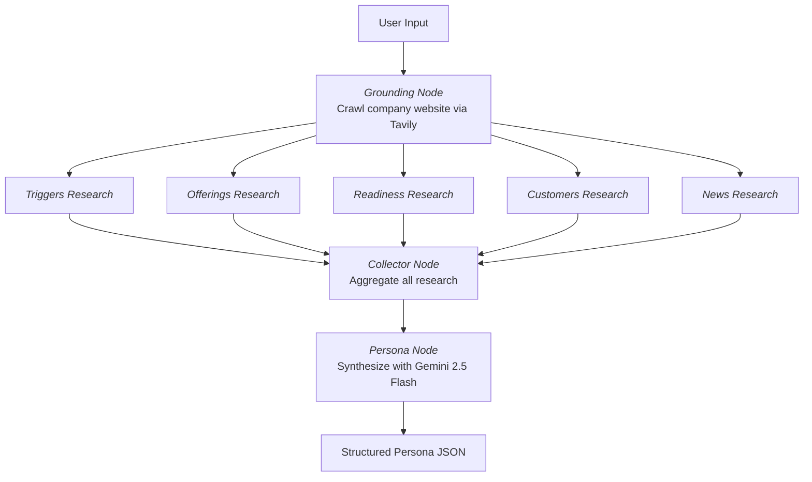

# AI-SDR Agent

An agentic research pipeline that takes a company name and URL, runs parallel web research across five dimensions, and synthesizes a structured sales persona — giving SDRs instant, grounded intelligence before they reach out. A second page lets SDRs cross-reference their own product against the researched company to get a tailored pitch brief.

---

## Demo
<p align="center">
  <a href="https://youtu.be/1R-8eKzgRdU" target="_blank">
    
  </a>
</p>

---

## How It Works

### Company Research

The user enters a company name, URL, industry, and HQ location. The system crawls the website, runs five parallel research workflows, aggregates the findings, and synthesizes everything into a structured persona using an LLM — all streamed live to the UI.


```mermaid
flowchart TD
    A[User Input] --> B[<i>Grounding Node</i><br>Crawl company website via Tavily]
    
    B --> C1[<i>Triggers Research</i>]
    B --> C2[<i>Offerings Research</i>]
    B --> C3[<i>Readiness Research</i>]
    B --> C4[<i>Customers Research</i>]
    B --> C5[<i>News Research</i>]
    
    C1 --> D[<i>Collector Node</i><br>Aggregate all research]
    C2 --> D
    C3 --> D
    C4 --> D
    C5 --> D
    
    D --> E[<i>Persona Node</i><br>Synthesize with Gemini 2.5 Flash]
    E --> F[Structured Persona JSON]
```

### Research Nodes (run in parallel)

| Node | What it finds |
|------|--------------|
| **Triggers Researcher** | Hiring signals, product launches, partnerships, strategic initiatives |
| **Offerings Researcher** | Core products, platform capabilities, differentiation |
| **Readiness Researcher** | Integrations, APIs, security/compliance signals, pricing model |
| **Customers Researcher** | Target industries, ICP, known customers and case studies |
| **News Analyst** | Recent funding, press releases, leadership changes, announcements |

Each research node generates 4 targeted search queries using OpenAI, executes them in parallel via Tavily, and merges the results.

### Real-Time Progress

The frontend connects to an SSE stream (`/research/{job_id}/stream`) as soon as the job starts. Each node completion is pushed as an event and the UI updates the progress stepper live — no polling.

### Result Caching

Completed personas are cached in memory for 60 minutes. If the same company and URL are submitted again within that window, the pipeline is skipped entirely and the cached result is returned instantly. The UI shows a "Cached · Xm ago" badge to indicate when a result came from cache.

### My Pitch — Seller Cross-Reference

After researching a company, the SDR can navigate to the **My Pitch** page and enter their own product details. A single LLM call cross-references the seller's product against the company persona and returns a structured pitch brief:

- **Fit Assessment** — Strong / Moderate / Weak with a plain-English rationale
- **Lead With This** — the single best entry point and why
- **How to Position It** — how to frame the product in the company's own language
- **Objection Map** — one card per company red flag with a how-to-handle and reframe
- **Outreach Templates** — copy-to-clipboard email subject, email opener, and call opener

If the fit is **Weak**, outreach templates are withheld and a clear "not a strong match" notice is shown instead — protecting the SDR's credibility.

---

## Persona Output

The result is split across two tabs in the UI.

### Company Profile tab
Strategic company intelligence — products, target markets, sales triggers, impact metrics, and sales intelligence flags.

```json
{
  "company_name": "Snorkel AI",
  "industry": "Enterprise AI Data Development",
  "hq_location": "Redwood City, CA",
  "mission_statement": "Enable every enterprise to turn expert knowledge into specialized AI at scale.",
  "core_products": [
    { "name": "Snorkel Flow", "description": "Programmatic data labeling platform" },
    { "name": "Snorkel Evaluate", "description": "AI evaluation for enterprise settings" }
  ],
  "target_markets": {
    "industries": ["Banking & Finance", "Healthcare", "Insurance", "Public Sector"],
    "ideal_customer_profile": "Large enterprises building or fine-tuning custom AI models at scale"
  },
  "sales_triggers": {
    "recent_funding_or_news": "Launched Snorkel Custom; integrated with Google Gemini and Meta Llama 3",
    "strategic_priorities": "Enabling agentic AI deployment in mission-critical enterprise settings"
  },
  "impact_metrics": [
    { "case_study": "Experian", "result": "Agent response times under 3 seconds" },
    { "case_study": "Wayfair", "result": "99% category win rate with data-centric AI" }
  ],
  "sales_intelligence": {
    "green_flags": ["SOC 2 Type II certified", "Active enterprise partnerships", "Strong ROI case studies"],
    "red_flags": ["Custom pricing only — longer sales cycles"],
    "compliance_standards": ["SOC 2 Type II", "HIPAA", "NIST CSF"]
  }
}
```

### Outreach Intel tab
SDR-focused intelligence — who to call, what they care about, why to reach out today, and how to open the conversation.

```json
{
  "buyer_roles": [
    {
      "title": "VP of Engineering",
      "department": "Engineering",
      "daily_pain_points": [
        "Manual code review bottlenecks slow down junior engineer onboarding",
        "Scaling team fast but AI tooling adoption is inconsistent across squads"
      ],
      "success_metrics": ["Deployment frequency", "Engineer onboarding time", "PR cycle time"],
      "typical_objections": ["We already use GitHub Copilot", "Security team won't approve new tooling mid-year"]
    }
  ],
  "outbound_hooks": [
    {
      "hook_type": "hiring",
      "specific_signal": "Posted 8 ML Engineer and Data Labeling roles in the past 30 days",
      "why_now": "Rapid ML hiring signals active model development — likely evaluating data tooling to support it",
      "source_or_evidence": "LinkedIn Jobs, March 2026"
    }
  ],
  "buyer_messaging": [
    {
      "role_title": "VP of Engineering",
      "value_prop": "Snorkel cuts the time your team spends manually labeling training data — letting engineers focus on model development, not data wrangling.",
      "pain_to_solution": "You're scaling your ML team fast but manual data labeling is a bottleneck — Snorkel's programmatic labeling removes that constraint without adding headcount.",
      "expected_outcome": "Teams using Snorkel ship production-ready models in under 60 days instead of 6 months.",
      "opening_hook": "Noticed you're scaling your ML team quickly — curious whether data labeling throughput is keeping up with the engineering hiring pace."
    }
  ]
}
```

### JSON export
Every completed research run is automatically saved to `outputs/<company>_<jobid>.json` in the project root — ready to share for feedback or analysis.

---

## My Pitch Output

Example seller brief for "Snorkel AI" when the seller's product is a data pipeline tool:

```json
{
  "fit_assessment": {
    "fit_level": "Strong",
    "rationale": "Snorkel AI's core workflow depends on high-throughput, reliable data pipelines — their recent scaling push makes this a timely conversation.",
    "strongest_connection": "Their 8 active ML Engineer hires signal active model development that will strain existing data infrastructure."
  },
  "lead_angle": {
    "entry_point": "Snorkel Flow's programmatic labeling at scale requires reliable, low-latency data ingestion — a gap their hiring pace suggests they haven't filled.",
    "why_this_first": "It maps directly to their most active pain signal (ML hiring) rather than a hypothetical future need."
  },
  "positioning": {
    "frame": "Position as the infrastructure layer that makes Snorkel Flow actually run at enterprise throughput — not another AI tool on top of it.",
    "against_priorities": "They've publicly committed to enabling agentic AI in mission-critical settings — that requires data reliability they can't afford to hand-build.",
    "differentiator_to_lead_with": "Managed SLA guarantees — enterprise compliance teams won't approve a pipeline without them."
  },
  "objection_map": [
    {
      "red_flag": "Custom pricing only — longer sales cycles",
      "how_to_handle": "Lead with a scoped pilot tied to one specific workflow so procurement doesn't need full budget approval upfront.",
      "reframe": "Ask: 'What does a 2-week delay in your labeling pipeline cost your model release timeline?'"
    }
  ],
  "outreach_templates": {
    "email_subject": "ML pipeline keeping up with your hiring pace?",
    "email_opener": "Saw Snorkel just posted 8 ML Engineer roles — that kind of scaling usually surfaces data pipeline bottlenecks before the team even notices. Worth a quick conversation?",
    "call_opener": "Hey, I noticed you're scaling your ML team pretty aggressively right now — I wanted to ask if data pipeline throughput has become a constraint yet."
  }
}
```

---

## Tech Stack

**Backend**
- [FastAPI](https://fastapi.tiangolo.com/) — REST API + Server-Sent Events
- [LangGraph](https://langchain-ai.github.io/langgraph/) — Stateful multi-node research workflow
- [Tavily](https://tavily.com/) — Website crawling and web search
- [OpenAI](https://openai.com/) — Query generation in research nodes
- [Google Gemini 2.5 Flash](https://deepmind.google/technologies/gemini/) — Persona synthesis and seller brief generation
- [slowapi](https://github.com/laurentS/slowapi) — Rate limiting

**Frontend**
- [React](https://react.dev/) + [TypeScript](https://www.typescriptlang.org/) — UI
- [React Router](https://reactrouter.com/) — Client-side routing (Company Research / My Pitch pages)
- [Vite](https://vitejs.dev/) — Build tooling
- [Tailwind CSS](https://tailwindcss.com/) — Styling
- [EventSource API](https://developer.mozilla.org/en-US/docs/Web/API/EventSource) — SSE-based live progress

---

## Setup

### Prerequisites
- Python 3.12+
- Node.js 18+
- [uv](https://docs.astral.sh/uv/) (Python package manager)

### 1. Clone the repo

```bash
git clone https://github.com/your-username/AI-SDR-Agent.git
cd AI-SDR-Agent
```

### 2. Configure environment variables

Copy `.env.example` to `.env` in the project root and fill in your keys:

```env
OPENAI_API_KEY=your_openai_key
GEMINI_API_KEY=your_gemini_key
TAVILY_API_KEY=your_tavily_key
LANGSMITH_API_KEY=your_langsmith_key   # optional
APP_API_KEY=your_random_secret         # optional — enables API key auth
ALLOWED_ORIGIN=http://localhost:5173   # CORS origin
```

Copy `ui/.env.example` to `ui/.env`:

```env
VITE_API_BASE_URL=http://0.0.0.0:8000
VITE_API_KEY=your_app_api_key          # must match APP_API_KEY above if set
```

### 3. Install backend dependencies

```bash
uv sync
```

### 4. Install frontend dependencies

```bash
cd ui
npm install
```

### 5. Run the backend

```bash
uv run python main.py
```

The API will be available at `http://0.0.0.0:8000`.

### 6. Run the frontend

```bash
cd ui
npm run dev
```

Open `http://localhost:5173` in your browser.

---

## Project Structure

```
AI-SDR-Agent/
├── docs/
│   └── sdr-demo.gif
├── outputs/                       # Auto-saved JSON files from completed research runs
├── main.py                        # FastAPI server, SSE stream, seller brief endpoint, job runner
├── backend/
│   ├── graph.py                   # LangGraph workflow definition
│   └── src/
│       ├── nodes/
│       │   ├── grounding.py       # Website crawl node
│       │   ├── collector.py       # Research aggregation node
│       │   ├── persona.py         # LLM persona synthesis node
│       │   └── research_nodes/
│       │       ├── base.py        # Shared query generation + search logic
│       │       ├── triggers.py
│       │       ├── offerings.py
│       │       ├── readiness.py
│       │       ├── customers.py
│       │       └── news.py
│       ├── schema/
│       │   └── state.py           # TypedDicts for graph state + job status store
│       └── utils/
│           ├── prompts.py         # All LLM prompts (persona + seller brief)
│           └── json_utils.py      # Output schemas + serialization helpers
└── ui/
    └── src/
        ├── client.ts              # API client — SSE stream + seller brief fetch
        ├── App.tsx                # Routes (always-mounted for state persistence)
        ├── pages/
        │   └── SellerPage.tsx     # My Pitch page
        ├── components/
        │   ├── Home.tsx           # Company Research page + tab switcher
        │   ├── PersonaPanel.tsx   # Company Profile tab
        │   ├── OutreachPanel.tsx  # Outreach Intel tab (buyer roles, hooks, messaging)
        │   ├── ProgressPanel.tsx  # Live research progress stepper
        │   ├── Header.tsx         # Nav — Company Research / My Pitch
        │   └── Field.tsx
        └── types/
            └── persona.ts         # Frontend types — persona + seller brief
```
